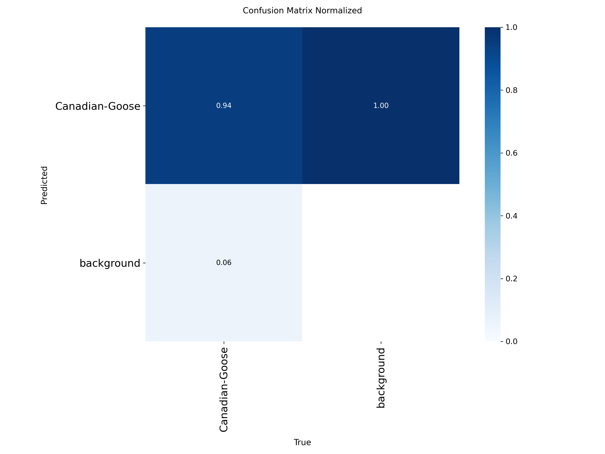
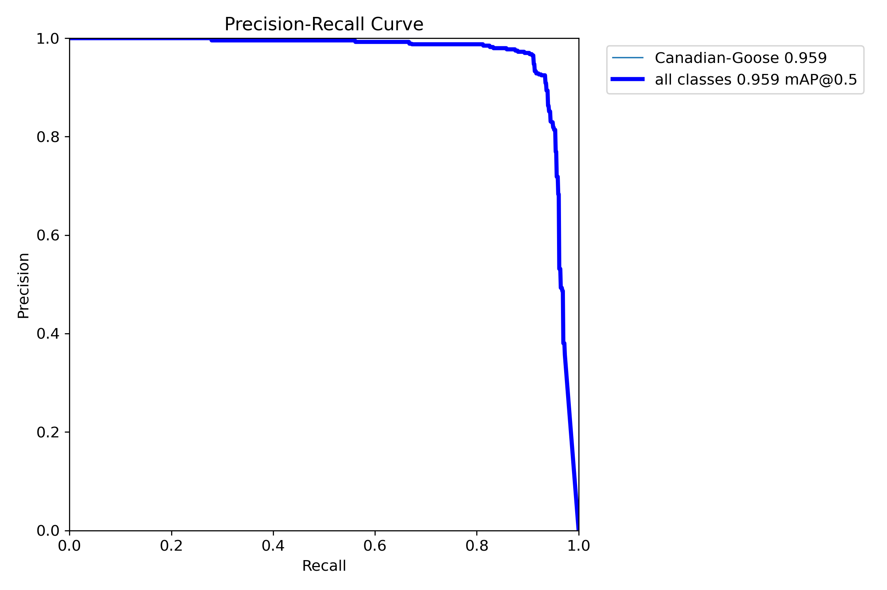

# Canadian Goose Detector

A computer vision project to detect Canadian geese using YOLOv8.

## Project Overview

This project uses the YOLOv8 nano model to detect Canadian geese in images and video streams. The model is trained on a dataset of Canadian goose images and can be deployed on various platforms, including Raspberry Pi for real-time detection.

## Dataset

The dataset consists of 947 annotated images of Canadian geese from Roboflow. The data is organized in the YOLO format with train/valid/test splits.

## Model Performance

The model is a YOLOv8 nano variant fine-tuned specifically for Canadian goose detection. Key metrics:
- mAP50: 0.94
- mAP50-95: 0.72
- Precision: 0.91
- Recall: 0.92




## Repository Structure

```
goose/
├── data/                # Dataset files
├── goose_project/       # Training outputs and model weights
│   └── goose_detector4/
│       └── weights/
│           ├── best.pt  # Best model weights
│           └── last.pt  # Last checkpoint weights
├── train.py            # Training script
├── evaluate.py         # Evaluation script
├── webcam_detect.py    # Webcam detection script
└── README.md           # This file
```

## Usage

### Setup

```bash
# Clone the repository
git clone https://github.com/ryancwelch/goose_detector.git
cd goose_detector

# Create and activate virtual environment
python -m venv venv
source venv/bin/activate  # On Windows: venv\Scripts\activate

# Install dependencies
pip install -r requirements.txt
```

### Evaluation

```bash
python evaluate.py
```

### Webcam Detection

```bash
python webcam_detect.py --device cpu  # For Raspberry Pi
# or
python webcam_detect.py --device 0    # For GPU
```

## Raspberry Pi Deployment

For deployment on Raspberry Pi:

1. Clone this repository
2. Install dependencies
3. Run the webcam detection script with `--device cpu`

## License

This project is licensed under the MIT License - see the LICENSE file for details.

## Acknowledgments

- Dataset provided via Roboflow
- Built with Ultralytics YOLOv8 